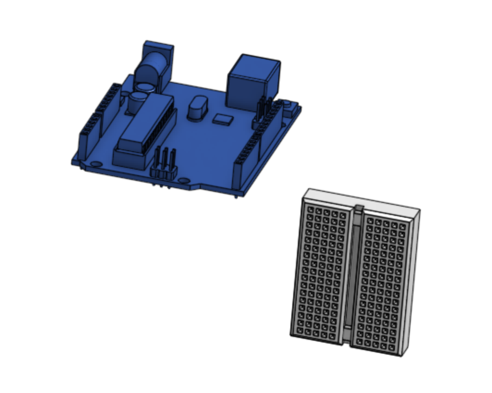
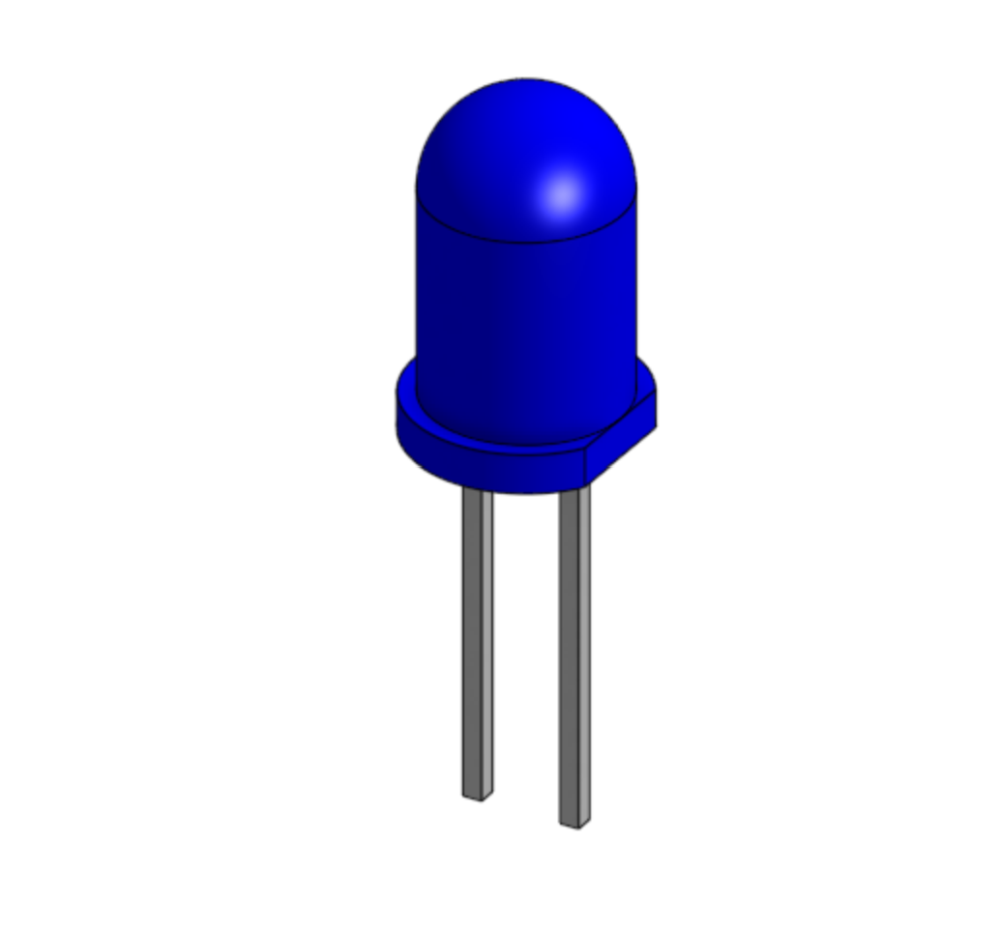
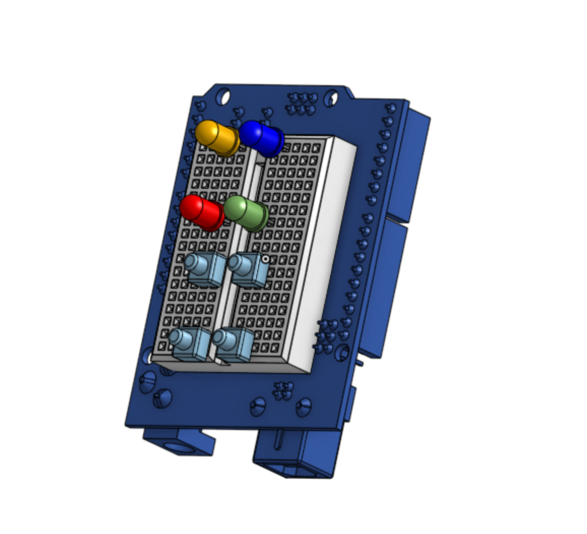
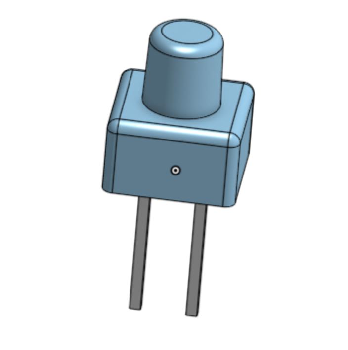

# Devlogs

Hi! Welcome to my devlogs for my Gameboy project! Since it will be hardware-centered, most of my work will be on Onshape or in real life. That means that you can check out Lapse to see me work! Of course, I will still be documenting everything here (:

# Devlog 1
1h 18min 19sec Logged

I stared working on my Gameboy project today! I imported many of the parts that I would need to model my project on Onshape, like the Arduino Uno R3 and the mini breadboard. However, I wanted to create some of the parts from scratch, like the LEDs. So, I found their dimensions online and created a part studio for them. To save on time, I just created one and duplicated it four times to get four different colors. I chose blue, green, yellow, and red. I want to model a breadboard with four LEDs and four buttons to create a simple Simon-says game. After replicating it in real life, I will have the proof-of-concept I need to invest in an OLED screen and joystick. Those parts will give the gameboy many more possibilities. 

# Devlog 2
1h 0min 10sec Logged

I found the dimensions of simple push buttons for breadboards online and replicated them in Onshape. With that, I finished putting together the first model of my Gameboy! It is an Anduino Uno R3 with a breadboard on the back. The breadboard has four LEDs and four buttons. The buttons are each controlled by one LED. The LEDs will flash in an increasingly complicated order, which you will have to repeat on the buttons. This is a simple Simon Says game. There is not yet a need for a case, as the wiring will be minimal. I will be replicating my model in real life next. 

# Devlog 3
1h 0min 15sec Logged

I built the Simon Says prototype on a breadboard. I fixed four LEDs (one red, one yellow, one blue, and one green) and four push buttons into the slots. I connected all of the cathodes of the LEDs and one leg of each of the buttons to GND. I connected the red LED to D9, yellow to D8, blue to D11, and green to D10. The buttons went to digital pins 2-5. In order to make the most of each GND slot, I used WAGOs to connect four components to one slot. I will now be working on the Simon Says code. 

