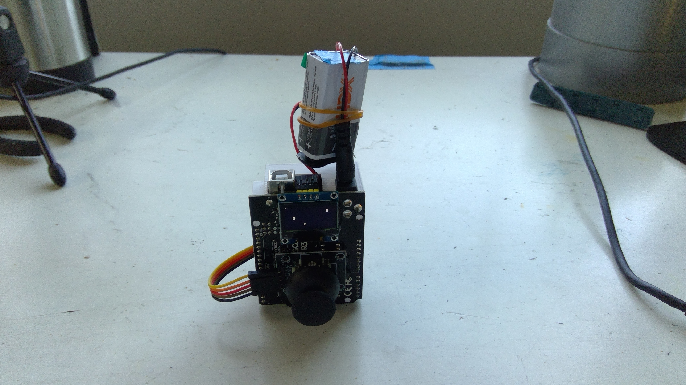
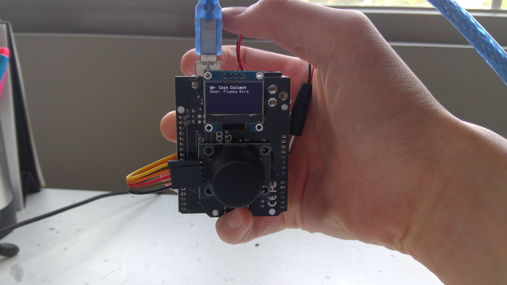
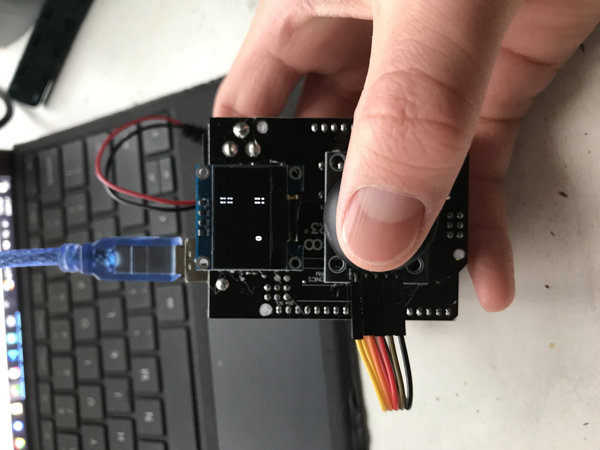
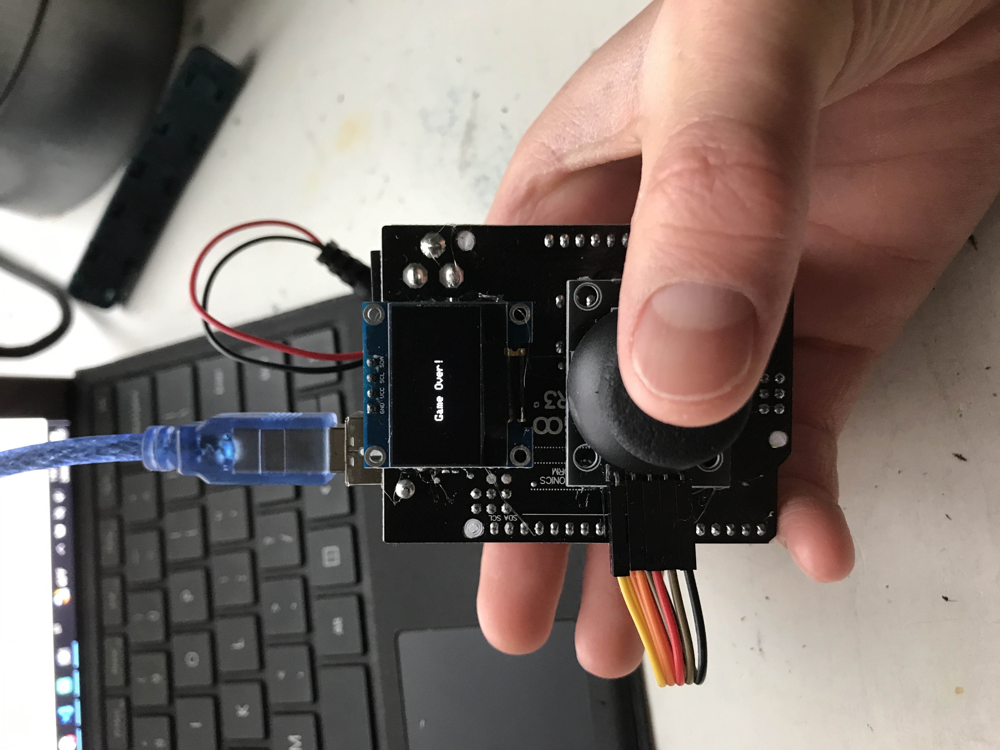
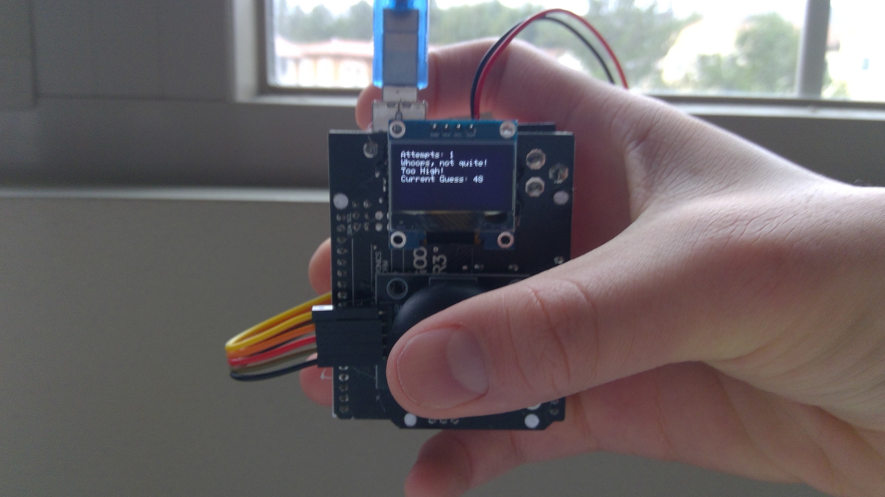
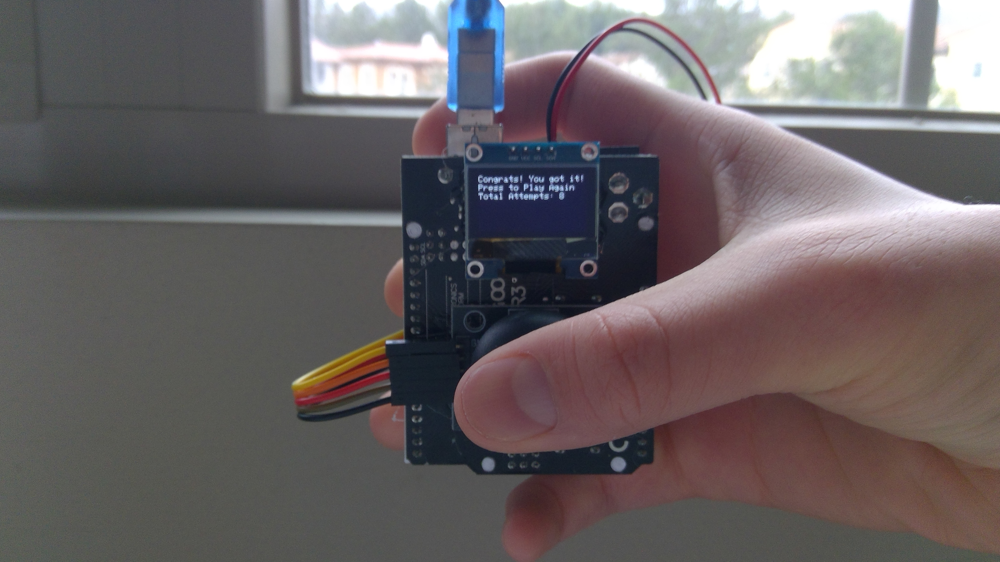
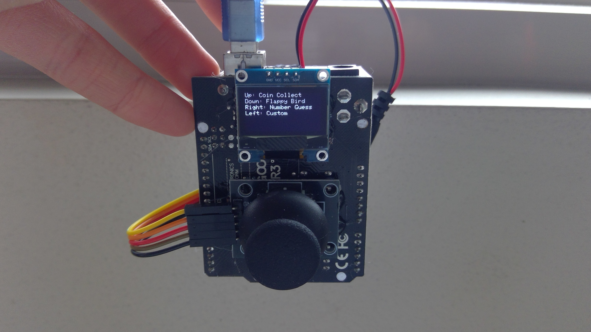
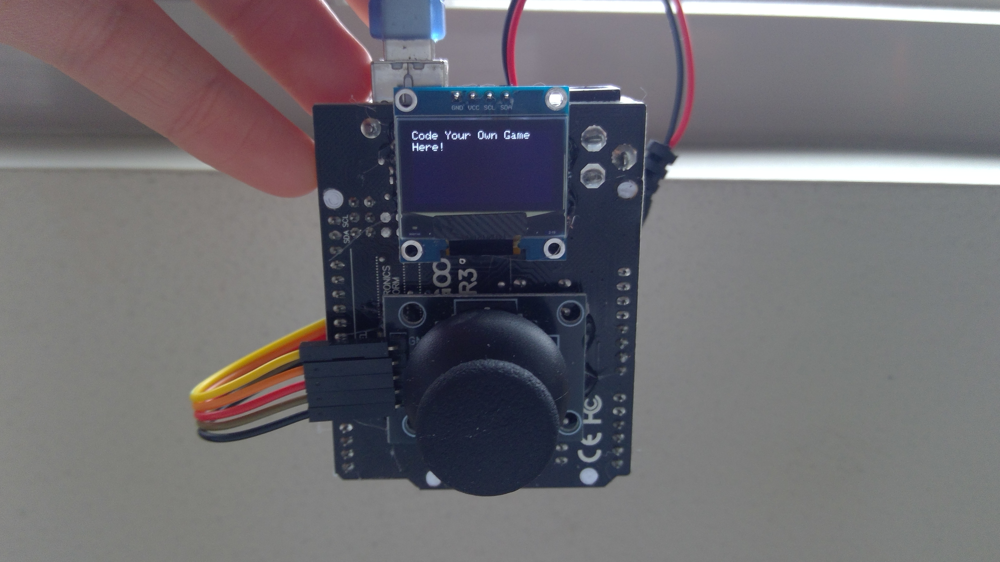

# Devlogs

Hi! Welcome to my devlogs for my Gameboy project! Since it will be hardware-centered, most of my work will be on Onshape or in real life. That means that you can check out Lapse to see me work! Of course, I will still be documenting everything here (:

# Devlog 1
1h 18min 19sec Logged

I stared working on my Gameboy project today! I imported many of the parts that I would need to model my project on Onshape, like the Arduino Uno R3 and the mini breadboard. However, I wanted to create some of the parts from scratch, like the LEDs. So, I found their dimensions online and created a part studio for them. To save on time, I just created one and duplicated it four times to get four different colors. I chose blue, green, yellow, and red. I want to model a breadboard with four LEDs and four buttons to create a simple Simon-says game. After replicating it in real life, I will have the proof-of-concept I need to invest in an OLED screen and joystick. Those parts will give the gameboy many more possibilities. 

# Devlog 2
1h 0min 10sec Logged

I found the dimensions of simple push buttons for breadboards online and replicated them in Onshape. With that, I finished putting together the first model of my Gameboy! It is an Anduino Uno R3 with a breadboard on the back. The breadboard has four LEDs and four buttons. The buttons are each controlled by one LED. The LEDs will flash in an increasingly complicated order, which you will have to repeat on the buttons. This is a simple Simon Says game. There is not yet a need for a case, as the wiring will be minimal. I will be replicating my model in real life next. 

# Devlog 3
1h 0min 15sec Logged

I built the Simon Says prototype on a breadboard. I fixed four LEDs (one red, one yellow, one blue, and one green) and four push buttons into the slots. I connected all of the cathodes of the LEDs and one leg of each of the buttons to GND. I connected the red LED to D9, yellow to D8, blue to D11, and green to D10. The buttons went to digital pins 2-5. In order to make the most of each GND slot, I used WAGOs to connect four components to one slot. I will now be working on the Simon Says code. 

# Devlog 4
55m Logged

I coded part of the Simon Says prototype. I made the part where the lights flash in an ascending order. To be honest, I spent a lot of time backtrackking because I'm new to coding and I made a lot of mistakes. However, the code is working smoothly now, and I will add the playing feature next. Here are some pics of the Gameboy working.

# Devlog 5
1h 44min Logged

I finished coding the Simon Says prototype! I coded the success pattern and the fail pattern. I even added a mechanic where the light of the button you press shines when you press it while reciting your memory, so you know that the Arduino is reading your inputs correctly! Its works quite well now, and this was the proof of concept that I needed to go all-in and build/code a full Gameboy with a joystick and an OLED. I can't wait to get started on it!

# Devlog 6
1h 8min 1sec Logged

I finished modeling the finalized Gameboy! It was quite a simple matter to add the OLED and the joystick. I had learned quite a few tricks for adding non-parasolid files to Onshape, and I was able to quickly put them where I wanted. The more difficult part was modeling the case. I want the finished product to look neat, and not have wires flying all over the place, so I took some time to model a case around a duplicate of the Arduino I imported. I took down parts of some of the walls to allow wires through. I had to keep in mind how the case would be printed, and I avoid as many overhangs as possible. I finished off by fitting the case onto the assembly! Take a look!

# Devlog 7
27min Logged

I built the Gameboy V1 today! I used a joystick and an OLED for the controls and the screen, and I attached the printed case onto the back. I had stuffed a battery in the case as well, but it was only after I hammered the case on did I realize that it was already dry! It's alright, I still want to improve the hardware someday anyway. Maybe I'll add a passive buzzer. In the meantime, I can always use another battery or a USB type B cable. Take a look!

# Devlog 8
39min Logged

I started coding the Gameboy V1 today! I started by testing the joystick to make sure that it worked. I made a simple code that updated the serial monitor on the status of the X, Y, and SW variables of the joystick. The only problem was that the X-value rested at 419 instead of 512, but there was still plenty of margin for me. I then made a simple code that printed an "A" on the screen, which you could move. The OLED and the joystick both worked. It was fun learning how to code the OLED, as I had not done much of that before! Take a look!

# Devlog 9
1h 36min Logged

I coded my first game on the Gameboy V1 today! Its a simple game where you go around collecting coins.

I wanted the sprite to point the direction you were going. I don't know how to actually draw, so I just used "^", "v", "<", and ">". It actually works quite well! 

I tried using a random number genreator to randomly generate coins but all it did was spew out the same sequence every time. Instead, I made 11 preset coins and made them cycle. 

The way the coins work is they wait for a certain ammount of time to pass since you started, then they appear. If you go on their coordinates while they are printed, they go away. I will make a scorekeeping system next. 

Things are looking good!

# Devlog 10
35min Logged

I finsihed coding the coin collection game. I added a score system, displayed on the upper right hand corner.

I also introduced a game selection system where the Gameboy enters a menu when you boot it up. You can flick the joystick in multiple directions in order to choose games. Right now, I just have a placeholder game with the coin collection game to test the system. That placeholder game is Flappy Bird. It works well. 

The way I did it was I made a variable called "game". In the loop, I wrote different if statements to see what value "game" is at. At 0, it is in the menu (it starts at 0). At 1, it enters Coin Collector (if you flick up). At 2, it enters flappy bird (if you flick down). I'm worried about the lag this may cause, because the code still has to run everything in the if statement (the entire code of the game) after checking the game state, but I don't know how to do this better right now. I hope things work out!

# Devlog 11
47min Logged

I coded the Flappy Bird game! It was actually pretty fun. Remember, this is the third code I'm ever making, and I'm still learning a lot! Getting to make smart solutions to difficult problems is what I like to do. 

First, I had to make the bird. I chose a capital "O" as a sprite. Then, I added gravity. In the sprite's display.setCursor line, I exchanged the y-value with h (for height). I made an integer called hi (for height-inertia). Every 100ms, hi goes down by one. If the Arduino senses that the joystick has been flicked up, hi will be set to 5. I set h to h-hi (because lower y-value means higher on the screen). Every time the game restarts, h is set to 30. 

Next, I added the obstacles. I used two horizontal lines, like "||". I printed a pair at y = 0, 10, 60, and 50 for each refresh. For their x-value, I set x to 120 initially, and made it go down by 2 every 100ms. I simply replaced the x-value with x in each of the "||"'s display.print line. In order to give the players a break, I made sure that the pipes were spaced properly apart. When they reach x = 0, time is reset, giving the players 1 second before the next pipe comes. This also applies to the start of the game. 

Finally, I had to add a losing mechanic. I made a seperate game mode (game mode 3) to act as a death screen. I'll be able to reuse this death screen in later games to save storage space. If h ever reaches below 0 or above 60, they will be sent to the game over screen. The hitboxes for the pipes were a little harder. I found the sizes of the pipes and the bird, and I made lots of if statements to determine if the bird is hitting a pipe or not. It starts with wether the pipes have reached the stationary bird (if x < 36 && x > 24). Then, it sees if the top of the bird is touching the top pipes or if the bottom of the bird is touching the bottom pipes (if h < 18 and if h > 42). Remember, the pipes and the bird are each 6 pixels wide and 8 pixels tall. The cursor prints text such that it remains at the top left. The game variable is set to 3 if any of these criteria are met. 

I should add a final game and a scoring mechanic to Flappy Bird Next! 

# Devlog 12
1h 4min Logged

I improved the Flappy Bird game and coded a Number Guessing game today!

First, I decided that the frequency of the pipes in Flappy Bird was too low. I decided to make them come faster. Gameplay is more exciting now! 

Next, I decided to code a new game. I decided to go with a classic Number Guessing game. The code consists of guessing a number, then being told wether that number is too big or too small. It took a while to get everything done, but I'll spare you the details because it was very basic work. 

A problem that I did have was the fact that the random number generator wasn't actually random. This was a problem that I encountered while coding my Simon Says prototype. To fix this, I gave the random number generator a seed. This seed is based off the reading of the floating analog pin 2. The random number generator works well now. 

Another problem that I encountered was running out of storage space. I was almost done with the Number Guessing game when this happened. The Arduino simply refused to take the code. Thankfully, I found a bit of repetitive code that I was able to delete to buy me just enough storage to squeeze this last game in. However, I want people to be able to code their own games onto this Gameboy, and I don't want them to have to choose between games to delete. So, I will have to spend some time optimizing the code. 

# Devlog 13
32min Logged

I finished optimizing the code! I made two functions that brought down the size of the code a lot. I also surrounded every text print with F() to lower the SRAM usage. Those two tricks helped! The Gameboy is looking good on storage again! That being said, I left the fourth game slot blank. It reads, "Code Your Own Game Here!"! I'll work on sound effects for the Gameboy V2 next. We'll be getting back to building!

