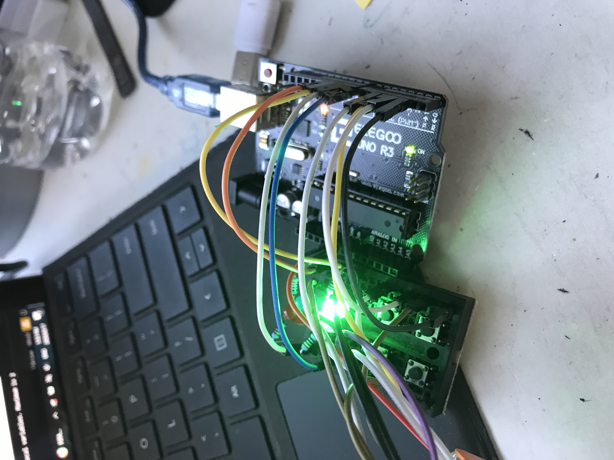
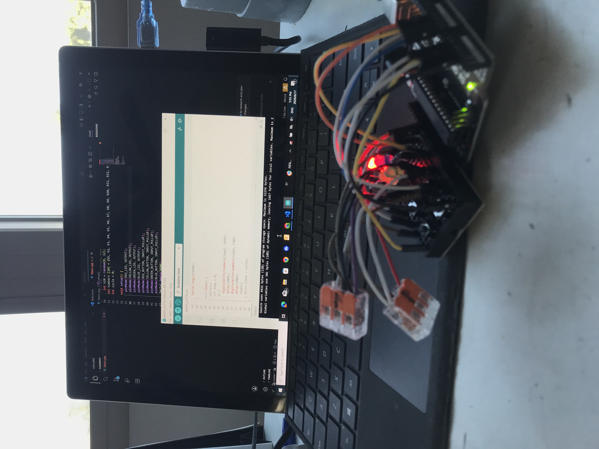
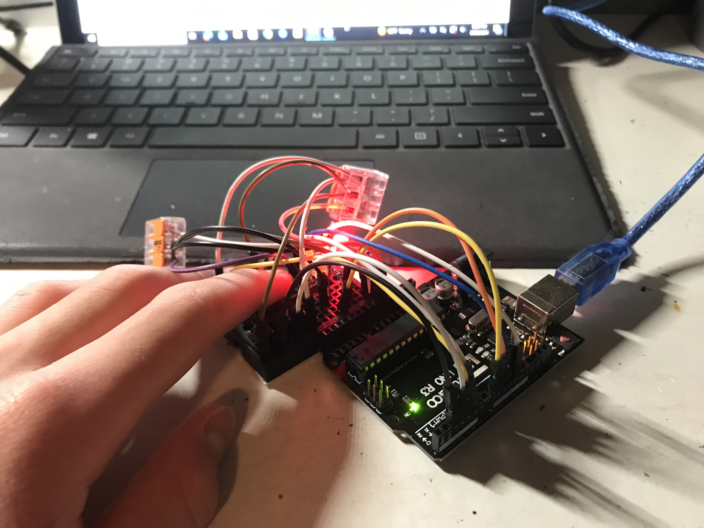
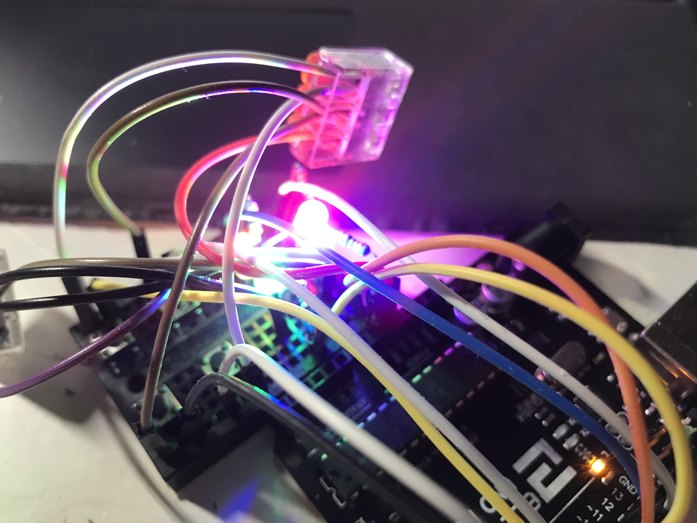
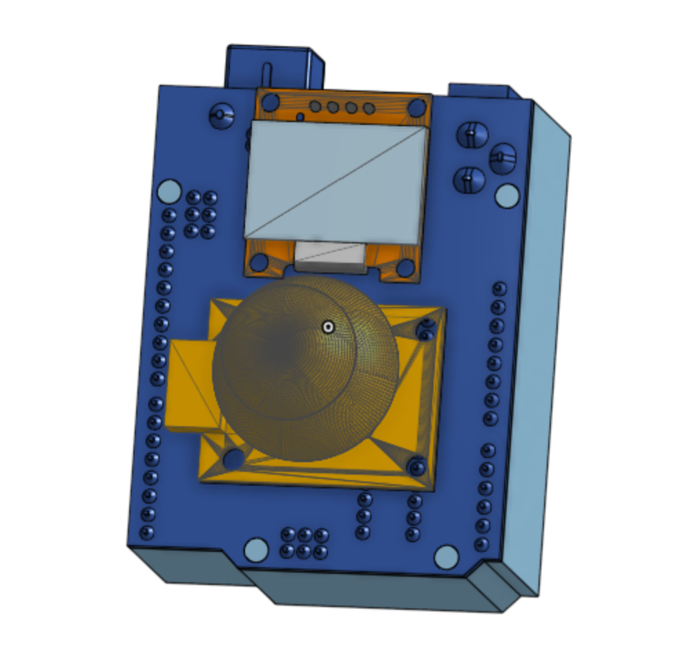
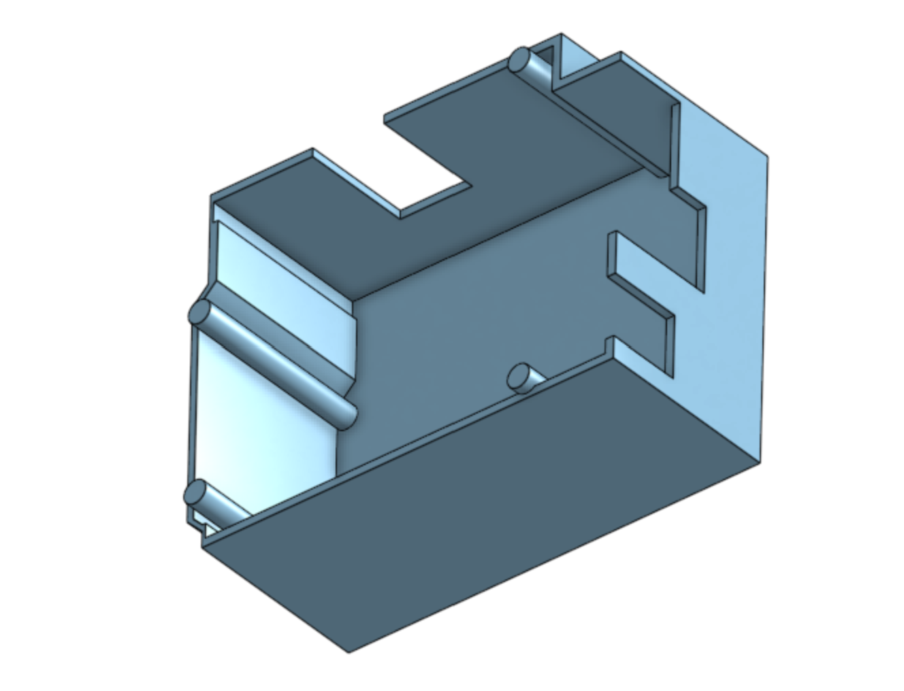
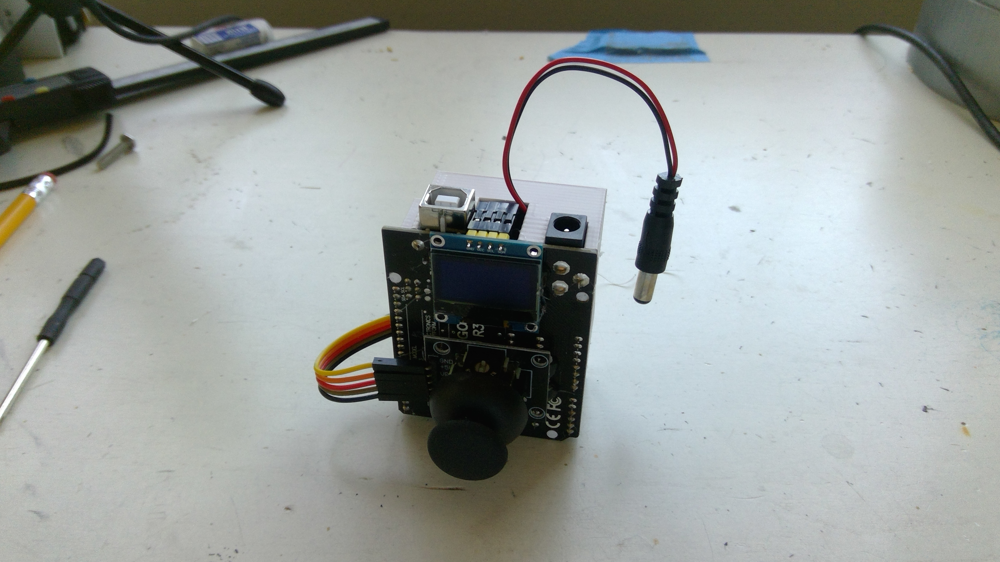
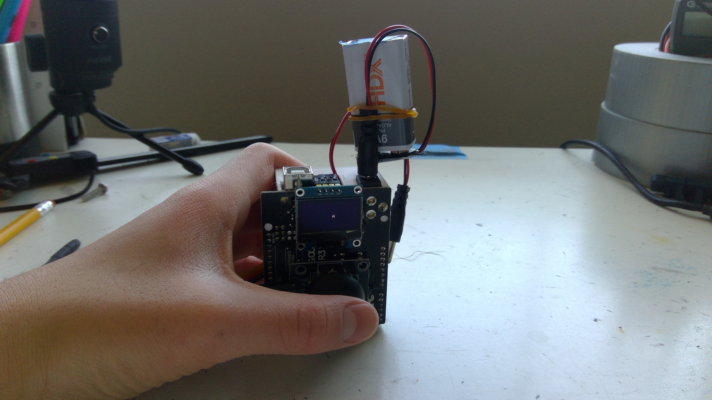
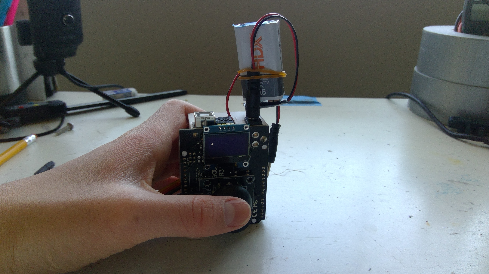

# Devlogs

Hi! Welcome to my devlogs for my Gameboy project! Since it will be hardware-centered, most of my work will be on Onshape or in real life. That means that you can check out Lapse to see me work! Of course, I will still be documenting everything here (:

# Devlog 1
1h 18min 19sec Logged

I stared working on my Gameboy project today! I imported many of the parts that I would need to model my project on Onshape, like the Arduino Uno R3 and the mini breadboard. However, I wanted to create some of the parts from scratch, like the LEDs. So, I found their dimensions online and created a part studio for them. To save on time, I just created one and duplicated it four times to get four different colors. I chose blue, green, yellow, and red. I want to model a breadboard with four LEDs and four buttons to create a simple Simon-says game. After replicating it in real life, I will have the proof-of-concept I need to invest in an OLED screen and joystick. Those parts will give the gameboy many more possibilities. 

# Devlog 2
1h 0min 10sec Logged

I found the dimensions of simple push buttons for breadboards online and replicated them in Onshape. With that, I finished putting together the first model of my Gameboy! It is an Anduino Uno R3 with a breadboard on the back. The breadboard has four LEDs and four buttons. The buttons are each controlled by one LED. The LEDs will flash in an increasingly complicated order, which you will have to repeat on the buttons. This is a simple Simon Says game. There is not yet a need for a case, as the wiring will be minimal. I will be replicating my model in real life next. 

# Devlog 3
1h 0min 15sec Logged

I built the Simon Says prototype on a breadboard. I fixed four LEDs (one red, one yellow, one blue, and one green) and four push buttons into the slots. I connected all of the cathodes of the LEDs and one leg of each of the buttons to GND. I connected the red LED to D9, yellow to D8, blue to D11, and green to D10. The buttons went to digital pins 2-5. In order to make the most of each GND slot, I used WAGOs to connect four components to one slot. I will now be working on the Simon Says code. 

# Devlog 4
55m Logged

I coded part of the Simon Says prototype. I made the part where the lights flash in an ascending order. To be honest, I spent a lot of time backtrackking because I'm new to coding and I made a lot of mistakes. However, the code is working smoothly now, and I will add the playing feature next. Here are some pics of the Gameboy working.

# Devlog 5
1h 44min Logged

I finished coding the Simon Says prototype! I coded the success pattern and the fail pattern. I even added a mechanic where the light of the button you press shines when you press it while reciting your memory, so you know that the Arduino is reading your inputs correctly! Its works quite well now, and this was the proof of concept that I needed to go all-in and build/code a full Gameboy with a joystick and an OLED. I can't wait to get started on it!

# Devlog 6
1h 8min 1sec Logged

I finished modeling the finalized Gameboy! It was quite a simple matter to add the OLED and the joystick. I had learned quite a few tricks for adding non-parasolid files to Onshape, and I was able to quickly put them where I wanted. The more difficult part was modeling the case. I want the finished product to look neat, and not have wires flying all over the place, so I took some time to model a case around a duplicate of the Arduino I imported. I took down parts of some of the walls to allow wires through. I had to keep in mind how the case would be printed, and I avoid as many overhangs as possible. I finished off by fitting the case onto the assembly! Take a look!

# Devlog 7
27min Logged

I built the Gameboy V1 today! I used a joystick and an OLED for the controls and the screen, and I attached the printed case onto the back. I had stuffed a battery in the case as well, but it was only after I hammered the case on did I realize that it was already dry! It's alright, I still want to improve the hardware someday anyway. Maybe I'll add a passive buzzer. In the meantime, I can always use another battery or a USB type B cable. Take a look!

# Devlog 8
39min Logged

I started coding the Gameboy V1 today! I started by testing the joystick to make sure that it worked. I made a simple code that updated the serial monitor on the status of the X, Y, and SW variables of the joystick. The only problem was that the X-value rested at 419 instead of 512, but there was still plenty of margin for me. I then made a simple code that printed an "A" on the screen, which you could move. The OLED and the joystick both worked. It was fun learning how to code the OLED, as I had not done much of that before! Take a look!

